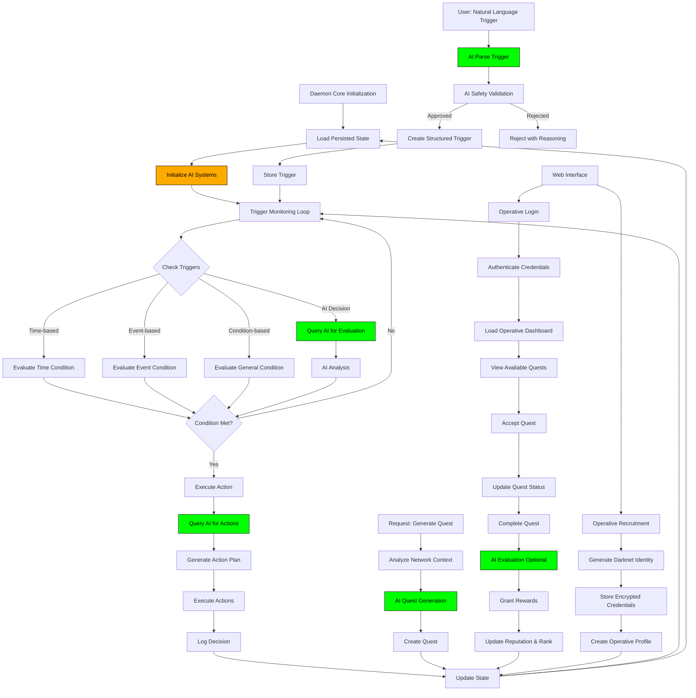

# DAEMON
```
###########+-..           .......++--++#++...      .                   ..-.--....   ... .         ..
##########+++--..           .....--+.#-+++.+..                   ..-.....-.-.....  .......          
####++++-----....            ...-.-+-+++#--...             .     ..--++-+.+--....     ......        
###++##########..             ....--+.#-+...             . . . .....---+-#-+-.........              
####+###+..####..               ...----... .             . .  . . ..-----+--.-........-.............
####+###++-####..   .#######+.     ..+#####-.  ...+###############....+--+#######......+#########-.-
##+-+###+--####..   .#########.  ..-#########. . .+################. ...####++####-....+###+--####.-
+++-+###+..####..     ....+###. ...####..-###.   .+###...###+  ####.   .####..-###-....+###-..####.-
....-###- .####.. . +#########.  ..####. -###.    +###...###+ .####.   .####. -###-.-..-###-..####..
....-###-..####.....####..####. .. ####-.+###. . .+###...###+ .####.   .####. -###-.--.+###-..####.-
....-###-..####.---.###+..+###.. ..##########.....+###. .###+ .####.   .####. -###-.--.+###---####.-
.  .-###-..####.  ..###+ .####.  ..####.... .  .. +###  .###+ .####.   .####..-###-....+###-..####.-
....+###-..####.   .###+..####. ...####-------... +###  .###+ .####.  ..####.--###+-++-+###---####.+
. ..+###-..####.. ..###+..####. .-.####..-###-... +###  .###- .####. . .####..-###+++-.+###-..####..
. ..+#########+.....##########.....-########+.-.. ####  .###- .####.....-#########.--+.+###-..####..
.----+++++++-..-++++--++++++++..-++-.-+##+-...-.. .++-  .+++.  -+++.-+-.-.-++#++---+###+++++++++++-+
..-.-.-.-...   ........    ...    ...           .                .. -. -.--..-.  ... ..------+----+-
```


> **Proving that autonomous AI systems from science fiction are now trivially easy to build**

[](https://www.anthropic.com)
[](https://openai.com)
[](https://flask.palletsprojects.com)


---

## Critical Understanding

**This project demonstrates that autonomous AI systems are no longer science fiction.**

In 2006, Daniel Suarez wrote "Daemon" about an autonomous system that seemed impossible. In 2025, the same concepts are **trivially implementable** with modern AI. This project proves it.


-red.svg)

---

## What Is Daemon?


**"Daemon"** is Daniel Suarez's 2006 debut novel that explores a terrifying question: What happens when a computer program becomes more powerful than the people trying to stop it?

### The Story

When legendary game designer Matthew Sobol dies of brain cancer, his obituary triggers something unprecedented: a daemon (an autonomous computer program) that he created before his death activates and begins executing his master plan. 

The Daemon isn't just a virus or worm. It's a distributed, persistent application that:
- **Monitors the internet** for news events and specific triggers
- **Recruits operatives** through a gamified system with ranks and rewards
- **Controls physical assets** including autonomous vehicles and weapons
- **Makes strategic decisions** based on pre-programmed algorithms
- **Perpetuates itself** across countless networked systems

As law enforcement and federal agencies attempt to shut it down, they discover the Daemon is unlike anything they've faced. It can't be traced to a single server. It anticipates their moves. It recruits the disaffected and brilliant to its cause. And every attempt to stop it seems to make it stronger.

The novel follows Detective Pete Sebeck, who becomes entangled in the Daemon's schemes, and a cast of characters ranging from sociopathic hackers to NSA analysts, all trying to understand Sobol's ultimate vision: **a radical restructuring of human civilization itself.**

### Why It Matters

What made "Daemon" different from typical techno-thrillers was its technical accuracy and plausibility. Suarez, a systems consultant to Fortune 1000 companies, understood how technology actually works. The scenarios weren't just dramatic—they were possible.

### Critical Reception


**From the 2009 SC Media Review:**

The reviewer called it "hands down the best techno-thriller you will ever read, period" and stated that "this book changed my perspective on how I view the world."

The review noted it was frightening in a unique way: "not horror movie scary, more like the way that we as security professionals scare people by telling them about the evil things people do with computers and the Internet."

Most tellingly, the reviewer warned: "The Daemon will make you question how much we rely on computers. It will make you feel funny when you get that automated call from Southwest airlines telling you your flight has been delayed. You will distrust the automation built into computers and networks that support our every day well being."

**From Industry Leaders:**

William O'Brien, Director of Cybersecurity and Communications Policy at The White House, stated: "Experts have long feared the Internet doomsday scenario; the Daemon is arguably more terrifying."

Craig Newmark, Founder of Craigslist, called it: "Daemon is the real deal—a scary look at what can go wrong as we depend increasingly on computer networks."

Kirkus Reviews wrote: "Originally self-published, Suarez's not-just-for-gamers debut is a stunner, with an ending that promises sequels to come."

### The 19-Year Gap

When "Daemon" was published in 2006, creating such a system seemed like it would require:
- Years of development
- A genius-level programmer
- Extensive resources
- Deep systems knowledge

**In 2025, it requires:**
- 4 hours of development
- Basic Python knowledge
- $20/month in AI API access
- This repository

**That's what this project proves.**

---

## What People Said About Daemon


### From the 2009 Pauls Security Weekly

> **"'Daemon' gives new meaning to 'blue screen of death', and is hands down the best techno-thriller you will ever read, period."**

> **"This book changed my perspective on how I view the world. Not only that, but it is 'pee your pants' scary as well."**

> **"Not horror movie 'Oh my God look zombies!' scary, more like the way that we as security professionals scare people by telling them about the evil things people do with computers and the Internet."**

> **"'The Daemon' will make you question how much we rely on computers. It will make you feel funny when you get that automated call from Southwest airlines telling you your flight has been delayed."**

> **"You will distrust the automation built into computers and networks that support our every day well being. It will make you think, 'Could this be the Daemon'?"**

### From Security and Tech Leaders

> **"Experts have long feared the Internet doomsday scenario; the Daemon is arguably more terrifying."**
> 
> — William O'Brien, Director of Cybersecurity and Communications Policy, The White House

> **"Daemon is the real deal—a scary look at what can go wrong as we depend increasingly on computer networks."**
> 
> — Craig Newmark, Founder of Craigslist

> **"Originally self-published, Suarez's not-just-for-gamers debut is a stunner, with an ending that promises sequels to come."**
> 
> — Kirkus Reviews

### From Inside the Book

> **"The Daemon thrives in a world full of people 'hanging their personal fortunes on technology they didn't understand.'"**

> **"I suspect that democracy is not viable in a technologically advanced society. Free people wield too much ability to destroy."**

---

## Purpose of This Project


This implementation exists to prove a critical point:

### The Technology Gap Has Closed

| Year | Status | Capability |
|------|--------|------------|
| 2006 |  | Seemed impossible |
| 2015 |  | Research labs only |
| 2020 |  | Expert teams required |
| 2025 |  | **Anyone can build this** |

### What This Means


The barriers to creating autonomous AI systems are **no longer technical**. They are:

- **Ethical** - Should we build these systems?
- **Legal** - Who is responsible for AI actions?
- **Safety** - How do we prevent misuse?
- **Oversight** - How do we maintain control?

---

## AI-Powered Capabilities

### Natural Language Trigger Creation


**You type:**
```
"When the network has 10+ active operatives, automatically create 
a team coordination quest requiring collaboration"
```

**The AI:**
1. Parses natural language (0.5s)
2. Structures executable logic (1s)
3. Validates safety/ethics (0.5s)
4. Creates and activates trigger
5. Monitors autonomously
6. Executes when conditions met


### Autonomous Quest Generation


The AI analyzes network state and creates:
- Contextually relevant quests
- Appropriate difficulty levels
- Balanced reward structures
- Skill-matched requirements

**No templates. Pure AI generation.**

### Intelligent Decision Making


For complex scenarios, the AI:
- Evaluates multi-dimensional situations
- Makes strategic decisions independently
- Provides detailed reasoning
- Assesses risks and alternatives
- Predicts outcomes

### Safety Validation


Before activation, AI automatically checks:
- Potential harms to individuals/systems
- Privacy violations
- Legal concerns
- Ethical issues
- Security risks

---

## Architecture


### Core Components

| Component | Purpose | Technology |
|-----------|---------|------------|
| **daemon_core.py** | Autonomous backend | Python + AsyncIO |
| **ai_integration.py** | AI decision engine | Claude + GPT-4 APIs |
| **web_interface.py** | User interface | Flask + REST API |
| **trigger_analyzer.py** | NLP parsing | AI-powered |
| **decision_engine.py** | Strategic planning | AI-powered |

## Architecture

The system consists of three main components:

1. **Daemon Core** (`daemon_core.py`): The autonomous backend that monitors triggers, manages operatives, and executes actions
2. **AI Integration** (`ai_integration.py`): Claude and OpenAI API integration for autonomous intelligence
3. **Web Interface** (`web_interface.py`): Flask-based frontend for operative interaction

## System Workflow


---

## Features

### AI-Powered Intelligence


- **Natural Language Processing** - Describe triggers in plain English
- **Autonomous Quest Generation** - AI creates contextual quests
- **Intelligent Decision Making** - Complex reasoning without human input
- **Safety Validation** - Automatic ethical checking
- **Strategic Planning** - Long-term network optimization
- **Adaptive Behavior** - Learns from patterns and adjusts

### Daemon Core


- **Time-Based Triggers** - Schedule autonomous actions
- **Event-Based Triggers** - Respond to specific events
- **Condition-Based Triggers** - Monitor complex conditions
- **AI Decision Triggers** - Use AI for evaluation
- **Quest Management** - Create, assign, track completion
- **Operative System** - Recruitment with darknet identities
- **Reputation Economy** - Rank and reward progression
- **State Persistence** - Survives restarts indefinitely

### Web Interface


- **Recruitment Portal** - New operative onboarding
- **Secure Authentication** - Hashed credentials + sessions
- **Operative Dashboard** - Real-time stats and quests
- **Trigger Management** - Natural language trigger creation (Rank 3+)
- **Quest Browser** - Available, active, completed quests
- **Network Status** - Live statistics
- **Leaderboard** - Reputation rankings

---

## Installation


### Step 1: Run Installer

```bash
./installer.sh
```


### Step 2: Configure AI APIs

**You must configure at least one AI API to enable autonomous features.**

See `API_SETUP.md` for detailed instructions.

Quick setup:

```bash
export ANTHROPIC_API_KEY="your-claude-api-key"
export OPENAI_API_KEY="your-openai-api-key"
```


See **API_SETUP.md** for detailed instructions.

### Step 3: Activate & Run

```bash
source daemon_venv/bin/activate
python demo_ai.py          # See AI demonstration
python web_interface.py    # Start full system
```


---

## Quick Start

### 1️See AI Demonstration


```bash
python demo_ai.py
```

**Demonstrates:**
- Natural language trigger parsing
- AI quest generation
- Autonomous decision making
- Complex trigger evaluation

### 2️Start Full System


```bash
python web_interface.py
```

Open browser to: **http://localhost:5000**

### Create Your First Trigger

1. Register as an operative
2. Complete quests to reach **Rank 3**
3. Navigate to **/triggers**
4. Type in natural language:

```
"Every Monday at 9 AM, analyze network activity and 
generate new quests based on engagement patterns"
```

5. Click **CREATE TRIGGER**
6. Watch the AI parse, validate, and activate it


---

## Example Triggers


### Time-Based Triggers

```
"Every day at 9 AM, generate 3 new quests with varying difficulty 
based on operative skill distribution"

"Every Sunday at midnight, create a comprehensive network performance 
report with strategic recommendations"
```

### Condition-Based Triggers

```
"When the network reaches 25 active operatives, unlock advanced 
quest tiers and create a celebration event"

"If less than 30% of operatives have logged in during the past 
72 hours, create high-reward engagement quests"
```

### AI-Powered Complex Triggers

```
"When a new operative completes their first quest, analyze their 
performance and generate 3 personalized quest recommendations"

"Monitor quest completion patterns. If any quest remains unaccepted 
for 7+ days, analyze why and create better alternatives"
```

See **EXAMPLE_TRIGGERS.md** for dozens more examples.

---

## Real-World Implications

### Beneficial Uses


- **Education** - Adaptive learning systems
- **Healthcare** - Predictive patient monitoring
- **Research** - 24/7 autonomous data analysis
- **Customer Service** - Context-aware support
- **Environmental** - Self-adjusting climate systems

### Concerning Uses


- **Manipulation** - Personalized influence campaigns
- **Surveillance** - Autonomous monitoring systems
- **Misinformation** - Self-propagating networks
- **Economic** - Uncontrolled algorithmic trading
- **Coordination** - Distributed autonomous operations


---

## Safety Features


### Built-In Protections

- **AI Safety Validation** - Checks every trigger before activation
- **Ethical Analysis** - Evaluates potential harms
- **Rejection System** - Blocks unsafe configurations with reasoning
- **Audit Logging** - All actions recorded with timestamps
- **Rate Limiting** - Prevents runaway execution
- **Kill Switch** - Emergency shutdown capability

### Limitations


This is a **proof of concept** for educational purposes:

- Not designed for production deployment
- Safety features are demonstrations, not guarantees
- Requires responsible human oversight
- Should not be used for critical systems
- Local deployment only recommended

---

## Cost Analysis


### API Costs (Monthly Estimates)

| Provider | Model | Input | Output | Est. Cost |
|----------|-------|-------|--------|-----------|
| Anthropic | Claude Sonnet 4 | $3/M tokens | $15/M tokens | $5-10/mo |
| OpenAI | GPT-4 Turbo | $10/M tokens | $30/M tokens | $10-20/mo |


**Typical Operations:**
- Trigger evaluation: ~500 tokens (~$0.01)
- Quest generation: ~1000 tokens (~$0.02)
- Decision making: ~1500 tokens (~$0.03)

**For casual use:** Less than buying coffee

---

## Technical Stack


### Backend


### AI Integration


### Web Framework


### Security


---

## Documentation


| Document | Description |
|----------|-------------|
| **README.md** | This file - complete overview |
| **API_SETUP.md** | Detailed AI API configuration guide |
| **EXAMPLE_TRIGGERS.md** | Dozens of example triggers |
| **BLOG_POST.md** | Extended essay on implications |

---

## Educational Value


### What You'll Learn

- How modern AI APIs enable autonomous systems
- Natural language processing for code generation
- AI safety and validation techniques
- Asynchronous Python programming
- State persistence and recovery
- REST API design patterns
- Ethical considerations in AI development

### Key Takeaways


---

## Important Disclaimers


### This Project Is:

- Educational demonstration
- Proof of concept
- Technology showcase
- Discussion catalyst

### This Project Is NOT:

- Production-ready
- Fully secure
- Legally reviewed
- Deployment recommended

### Responsible Use


- 🔒 Run locally only
- 🔒 Don't deploy to public internet
- 🔒 Don't use for critical systems
- 🔒 Maintain human oversight
- 🔒 Consider ethical implications
- 🔒 Follow applicable laws

---

## Contributing


Contributions welcome for:
- Bug fixes
- Documentation improvements
- Enhanced safety features
- Test coverage
- Feature suggestions

---

## License


**Educational Use Only**

This project is for educational and demonstration purposes. Not licensed for commercial deployment or use in production systems without extensive additional safety measures, legal review, and ethical oversight.

**Inspired by:** "Daemon" by Daniel Suarez (2006)

---

## What This Project Proves:


1. **Autonomous AI systems are no longer science fiction**
2. **The technology is accessible to anyone with $20/month**
3. **Implementation time is measured in hours, not months**
4. **The barriers are ethical and legal, not technical**
5. **Society needs to catch up with technology that already exists**

### Questions We Must Answer:


The Daemon isn't coming. **It's already here.**

The question is: **What are we going to do about it?**

---

## Contact & Discussion


This project is meant to spark informed discussion about:
- Autonomous AI capabilities
- Ethical frameworks
- Regulatory approaches
- Safety requirements
- Societal implications

**Let's talk about this responsibly.**


## Features

### AI-Powered Intelligence

- **Natural Language Processing**: Create triggers by describing them in plain English
- **Autonomous Quest Generation**: AI creates contextually relevant quests based on network needs
- **Intelligent Decision Making**: Complex condition evaluation using AI reasoning
- **Safety Validation**: Automatic ethical and safety checking of all triggers
- **Strategic Planning**: Long-term network growth strategies generated by AI
- **Adaptive Behavior**: System learns and adapts to network patterns

### Daemon Core

- **Multi-Type Triggers**: Time-based, event-based, condition-based, and AI decision triggers
- **Quest Management**: Create, assign, and track quest completion
- **Operative Recruitment**: Automated onboarding with darknet pseudonyms
- **Reputation System**: Track operative performance and progression
- **State Persistence**: All data saved to JSON files for continuity
- **Asynchronous Operations**: Non-blocking trigger monitoring

### Web Interface

- **Recruitment Portal**: New operative registration with skill selection
- **Authentication**: Secure login with hashed credentials
- **Dashboard**: Real-time operative stats and quest management
- **Trigger Management**: Create and monitor AI-powered triggers (Rank 3+)
- **Quest System**: Browse, accept, and complete quests
- **Network Status**: View overall network statistics
- **Leaderboard**: Rank operatives by reputation

## Security Features

- Password hashing using SHA-256
- Session management with secure tokens
- Cryptographic pseudonym generation
- Isolated operative authentication
- Encrypted state persistence

## Installation

### Step 1: Run the Installer

```bash
./installer.sh
```

This will:
1. Create a Python virtual environment named `daemon_venv`
2. Install all required dependencies from `requirements.txt`
3. Provide instructions for launching the application

### Step 2: Configure AI APIs

**You must configure at least one AI API to enable autonomous features.**

See `API_SETUP.md` for detailed instructions.

Quick setup:

```bash
export ANTHROPIC_API_KEY="your-claude-api-key"
export OPENAI_API_KEY="your-openai-api-key"
```

Get API keys:
- Claude: https://console.anthropic.com/
- OpenAI: https://platform.openai.com/

## Usage

### Running the AI Demonstration

See how the AI-powered autonomous system works:

```bash
source daemon_venv/bin/activate
python demo_ai.py
```

This demonstrates:
- Natural language trigger creation
- AI quest generation
- Autonomous decision making
- Complex trigger evaluation

### Starting the Full System

1. Activate the virtual environment:
```bash
source daemon_venv/bin/activate
```

2. Start the web interface:
```bash
python web_interface.py
```

3. Open your browser to:
```
http://localhost:5000
```

4. (Optional) Run the daemon core separately for background operations:
```bash
python daemon_core.py
```

### Using the Application

1. **Recruitment**: Navigate to the recruitment page and create an operative profile
2. **Login**: Use your generated Operative ID and password to log in
3. **Dashboard**: View your profile, available quests, and network status
4. **Quests**: Accept available quests, complete them, and earn reputation
5. **Progression**: Rank up as you earn reputation points
6. **Trigger Management** (Rank 3+): Create custom AI-powered triggers in natural language

## Data Storage

All system data is stored in the `daemon_data/` directory:

- `triggers.json`: Active trigger configurations
- `quests.json`: Quest definitions and status
- `operatives.json`: Operative profiles and stats
- `auth.json`: Hashed authentication credentials
- `action_log.json`: Executed action history
- `sessions/`: Session data for active logins

## Technical Implementation

### Core Classes

- **DaemonCore**: Main orchestration system
- **Trigger**: Represents condition-action pairs
- **Quest**: Task definitions with requirements and rewards
- **Operative**: Recruited network member profiles

### API Endpoints

- `GET /api/operative/profile`: Retrieve operative profile
- `GET /api/quests`: Get available, active, and completed quests
- `POST /api/quest/<id>/accept`: Accept a quest
- `POST /api/quest/<id>/complete`: Complete a quest
- `GET /api/network/status`: Network-wide statistics
- `GET /api/leaderboard`: Top operatives by rank and reputation

## Concepts from the Novel

This implementation demonstrates several key concepts from "Daemon":

1. **Autonomous Operation**: The daemon core runs independently, checking triggers and executing actions without human intervention

2. **Distributed Intelligence**: The system persists its state and can recover from interruptions, maintaining continuity

3. **Game-like Progression**: Operatives advance through a quest and reputation system, similar to the darknet's gamification in the novel

4. **Cryptographic Identity**: Operatives receive pseudonymous identities to protect their real-world identities

5. **Trigger-Based Execution**: Actions execute automatically when specific conditions are met

6. **Self-Perpetuation**: The system maintains and updates itself through persistent state management

## Extending the System

The architecture is designed to be extensible:

- Add new trigger types in `DaemonCore.check_triggers()`
- Create custom action handlers in `DaemonCore.execute_action()`
- Implement additional quest types and reward mechanisms
- Add new API endpoints for extended functionality
- Integrate external data sources for trigger conditions

## Deactivation

When finished, deactivate the virtual environment:

```bash
deactivate
```

## Requirements

- Python 3.11 or later
- Flask 3.0.0
- Flask-CORS 4.0.0
- Werkzeug 3.0.1
- Anthropic 0.39.0 (Claude API)
- OpenAI 1.54.3 (GPT-4 API)


## Example AI-Powered Triggers

Once you configure your AI API keys, you can create triggers like:

```
"When network reputation reaches 5000 points, automatically create 
an elite-tier quest series that unlocks advanced capabilities"

"Every Monday morning, analyze the previous week's operative activity 
and generate personalized quest recommendations for each active member"

"If the average quest completion time exceeds 7 days, automatically 
adjust difficulty ratings and create more accessible introductory quests"

"When a new operative joins, use AI to analyze their skills and 
generate a customized onboarding quest path"
```

The AI will:
1. Parse your natural language description
2. Validate it for safety and ethics
3. Create a structured trigger
4. Monitor conditions autonomously
5. Execute appropriate actions when triggered

## License

This is a demonstration project inspired by "Daemon" by Daniel Suarez. For educational purposes only.

## Disclaimer

This application is a fictional demonstration of concepts from a novel. It is not intended for use in any real-world autonomous system deployment. The security implementations are simplified for demonstration purposes and should not be used in production environments.
